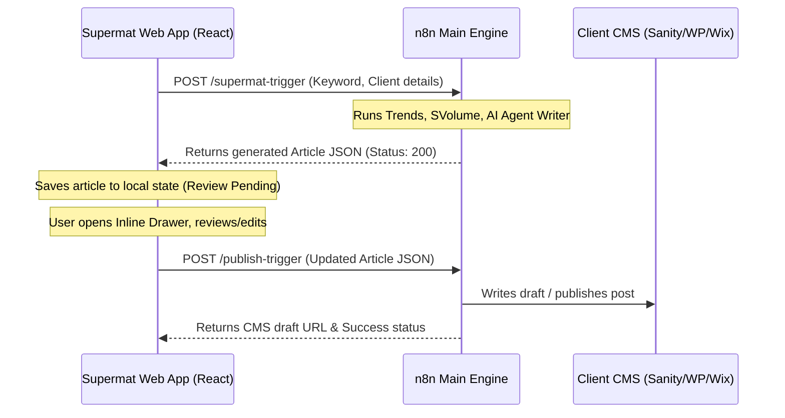

# Design Specification: Web Approver & Premium Locking System

This specification details the implementation of a web-based article approval workflow (Web Approver) and a premium tier simulator (Premium Lock) in the Supermat application.

## 1. Context & Objectives
Supermat connects to an n8n workflow that performs Google Trends keyword research, evaluates search volumes via Ahrefs, and generates SEO-friendly articles using Gemini. Currently, the workflow outputs directly to a CMS and notifies via Telegram. 
To improve usability (for users who do not want to configure Telegram bots) and enable monetization:
* **Web Approver**: Allow users to review, edit, and approve article drafts directly within the Supermat web app before they are posted to CMS platforms (Sanity, WordPress, Wix).
* **Premium Lock**: Introduce a licensing/plan system (Free vs. Premium) that locks advanced features (Web Approver, Telegram Approver, WhatsApp Approver) to incentivize premium subscriptions.

---

## 2. Selected Approach: Approach B (Inline Drawer)
The user has chosen **Approach B (Inline Drawer)**.

### A. Data Flow (Synchronous Webhook)

### B. UI Components & Interaction
1. **Keyword Table Suffix Action**:
   * For a keyword running automation, the status transitions to "AI Writing..." and then "Review Ready" (if Web Approver is enabled and user is Premium).
   * A "Tinjau Draf" (Review Draft) button appears, replacing "Buka Draf" or "Jalankan".
2. **Inline Drawer (Slide-out Panel)**:
   * Slides out from the right side.
   * **Header**: "Review Artikel: [Keyword]". Includes close button.
   * **Metrics Cards**: Volume (Ahrefs), Keyword Difficulty (KD), Traffic Potential.
   * **Editable Fields**:
     * Title (Input text)
     * Slug (Input text)
     * Excerpt (Textarea)
     * Body Markdown (Scrollable textarea or markdown editor preview tab).
   * **Action Buttons**:
     * **Publikasikan ke [CMS]** (Green button): Sends the edited article payload to n8n to publish to Sanity/WordPress/Wix, then marks status as "Draft Created" and saves CMS URL.
     * **Tolak / Regenerasi** (Red outline button): Discards the draft and allows re-triggering n8n.

---

## 3. Premium Lock & Plan Simulator
To demonstrate monetization, the app will include a mock plan manager.

### A. Subscription Tier Definition
* **Free Plan (Default)**:
  * Automations run end-to-end without review (publishes directly to CMS, matching previous behavior).
  * Web Approver, Telegram Approver, and WhatsApp Approver toggles are locked.
  * Tapping locked actions triggers a premium upgrade modal/toast.
* **Premium Plan**:
  * Unlocks the Web Approver toggle. When active, automation holds for Web Review before publishing.
  * Unlocks Telegram Approver and WhatsApp Approver settings.

### B. Plan Selector UI
* A **Subscription Plan Indicator** is added to the Sidebar (e.g., "Plan: Free (Upgrade)").
* A **Plan Switcher Card** is added to `CmsSettings.jsx` (Settings tab), allowing the user to toggle their simulated plan between **Free** and **Premium (Paid)** for testing.

### C. Approval Channel Toggles (Settings Tab)
In `CmsSettings.jsx`, a new section **Persetujuan Konten (Approval Channels)** will display:
1. **Web Approver**: Toggle switch. (Locked on Free plan).
2. **Telegram Bot Approver**: Toggle switch + Token inputs. (Locked on Free plan).
3. **WhatsApp Bot Approver**: Toggle switch + Phone input. (Locked on Free plan, marked "Soon").

---

## 4. Technical File Changes
* **Modify** [KeywordManager.jsx](file:///Users/mm/Supermat/frontend/src/components/KeywordManager.jsx):
  * Implement inline drawer component (HTML structure, React states for current draft, editing mode).
  * Handle synchronous webhook response from n8n (store draft JSON into keyword object in `localStorage`).
  * Wire up the "Approve & Publish" action which calls n8n or triggers the publish simulation.
* **Modify** [CmsSettings.jsx](file:///Users/mm/Supermat/frontend/src/components/CmsSettings.jsx):
  * Add Subscription Plan toggle.
  * Add Approval Channels section with premium locks.
* **Modify** [Sidebar.jsx](file:///Users/mm/Supermat/frontend/src/components/Sidebar.jsx):
  * Add Plan indicator badge (Free with amber "Upgrade" button vs. Premium with gold crown).
* **Modify** [App.jsx](file:///Users/mm/Supermat/frontend/src/App.jsx):
  * Pass global `plan` state down to components or load/save from `localStorage`.
* **Update** [n8n-main-workflow.json](file:///Users/mm/Supermat/automation/n8n-main-workflow.json):
  * Configure Webhook response settings to return the output payload instead of standard HTTP 200.

---

## 5. Verification Plan
* **Manual Verification**:
  1. Toggle between Free and Premium plans in Settings. Confirm Sidebar updates instantly.
  2. In **Free Plan**: verify Telegram, WhatsApp, and Web Approver switches are disabled/locked.
  3. In **Premium Plan**: verify Web Approver can be enabled.
  4. Run a keyword with Web Approver enabled. Verify status transitions to "Review Ready".
  5. Click "Tinjau Draf". Verify drawer slides out with mock article data.
  6. Edit the title and body markdown. Click "Publikasikan". Verify the draft is pushed and transitions to "Draf Sukses".
